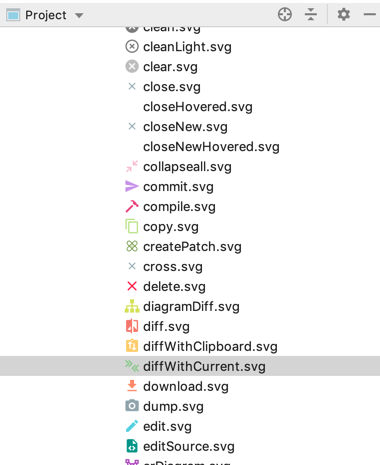
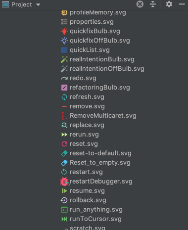

# Image Icon Viewer

<h1 align="center">
   
    
    
  Image Icon Viewer
   
   
</h1>

This is a JetBrains products' plugin to preview image files directly inside the Project View.

 

This is particularly helpful when working with a lot of icons.

Supports images with the following supported formats:

 - *.gif
 - *.png 
 - *.bmp
 - *.jpg
 - *.wbmp
 - *.svg

## Acknowledgements
Original plugin at https://github.com/davidsommer/IconViewer

Plugin Icon made by [Vectors Market](https://www.flaticon.com/authors/vectors-market) from [Flaticon](http://www.flaticon.com), licensed by [Creative Commons BY 3.0](http://creativecommons.org/licenses/by/3.0/)

## Authors:
- [David Sommer (dasoft.ch)](https://github.com/davidsommer)
- [Jonathan Lermitage (jonathanlermitage)](https://github.com/jonathanlermitage)
- [Elior Boukhobza (mallowigi)](https://github.com/mallowigi)
