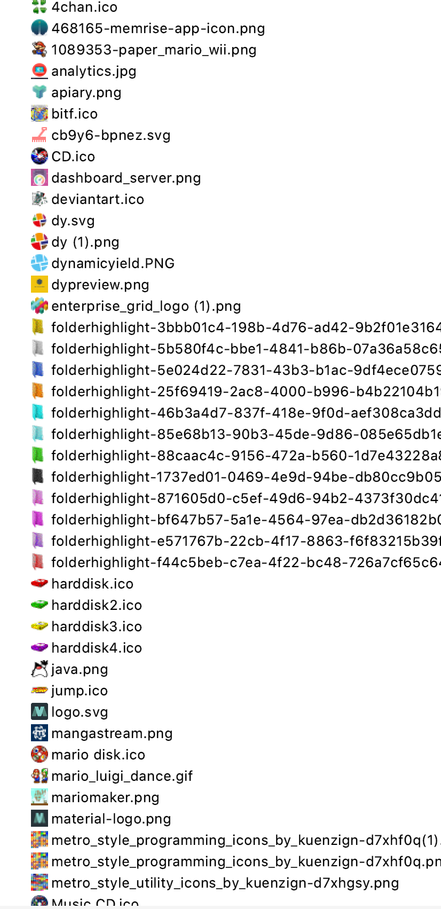

# Image Icon Viewer

<h1 align="center">
   
    
    
  Image Icon Viewer
   
   
</h1>

**Preview images and icons directly from the Project View.**

## Features

Supports the following formats:

 - *.gif
 - *.png 
 - *.bmp
 - *.jpg
 - *.wbmp
 - *.svg
 - *.tiff
 - *.bigtiff
 - *.dcx
 - *.icns
 - *.ico
 - *.jbig2
 - *.pam
 - *.pbm
 - *.pcx
 - *.pgm
 - *.pnm
 - *.ppm
 - *.psd
 - *.rgbe
 - *.tga
 - *.tif
 - *.tiff
 - *.wbmp
 - *.xbm
 - *.xpm
 
## Screenshots

 

## Acknowledgements
Original plugin at https://github.com/davidsommer/IconViewer

Plugin Icon made by [Vectors Market](https://www.flaticon.com/authors/vectors-market) from [Flaticon](http://www.flaticon.com), licensed by [Creative Commons BY 3.0](http://creativecommons.org/licenses/by/3.0/)

## Authors:
- [David Sommer (dasoft.ch)](https://github.com/davidsommer)
- [Jonathan Lermitage (jonathanlermitage)](https://github.com/jonathanlermitage)
- [Elior Boukhobza (mallowigi)](https://github.com/mallowigi)
